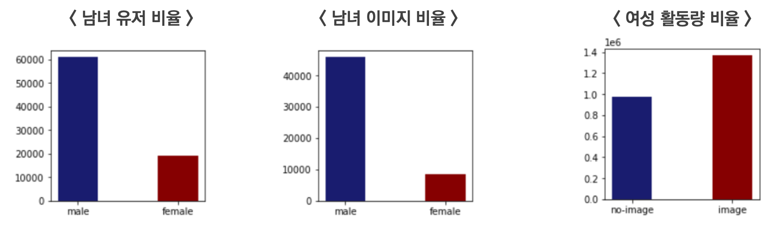
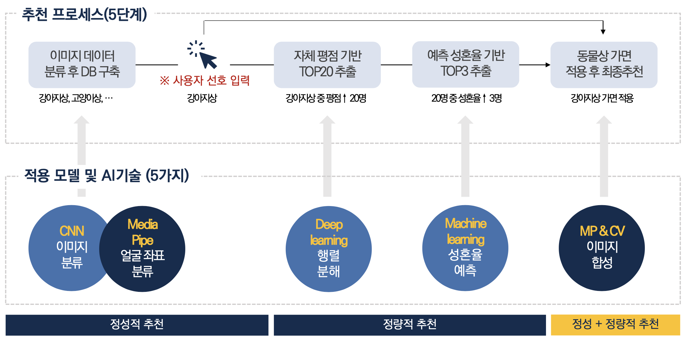
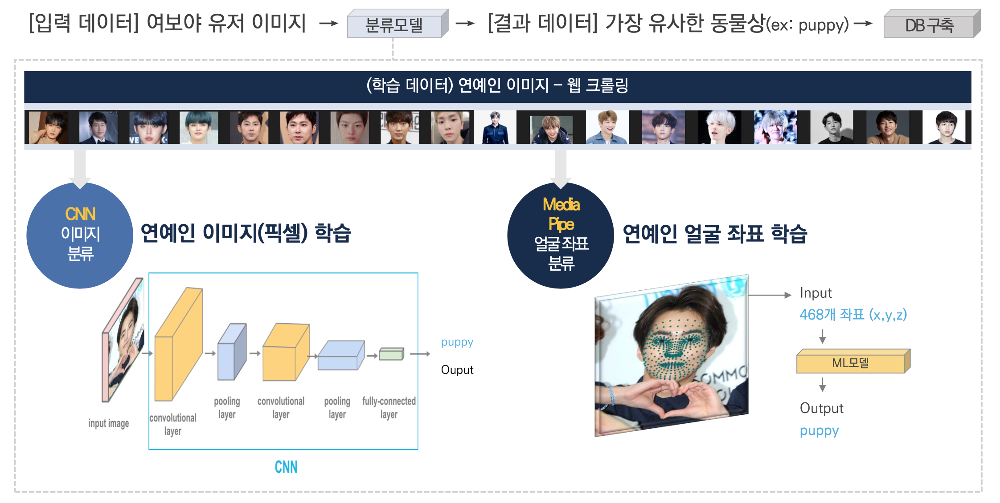
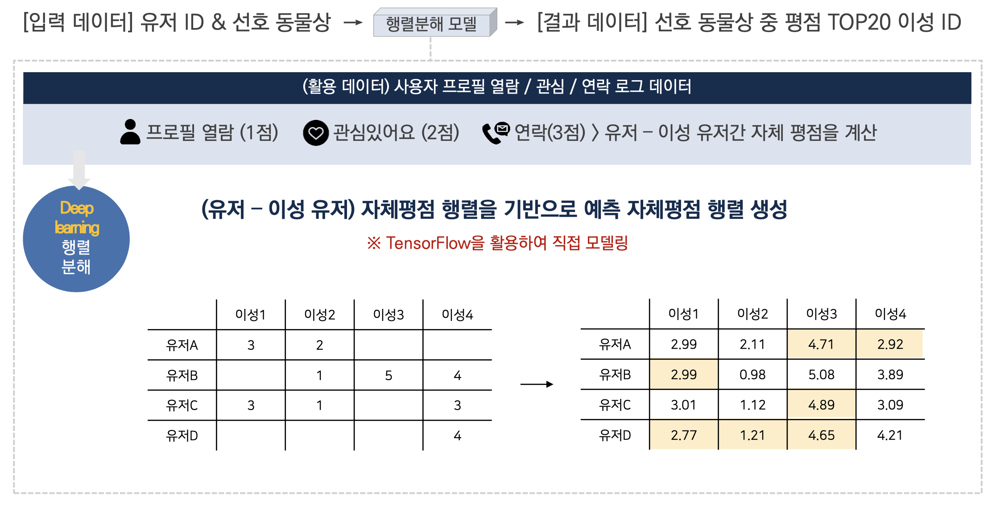
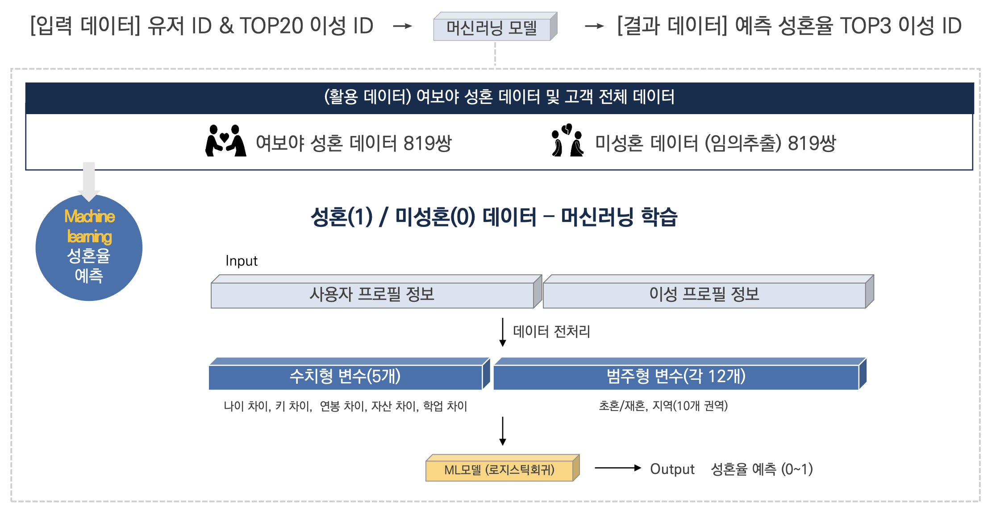
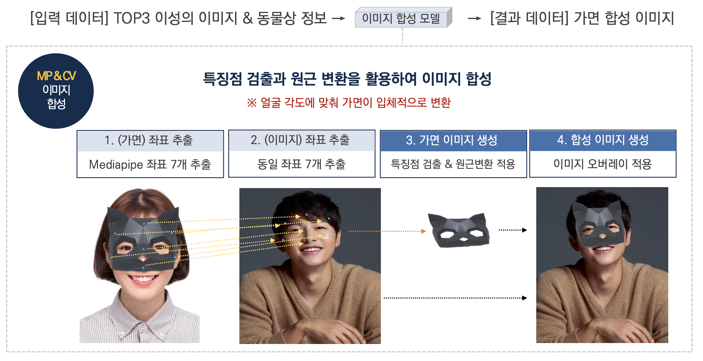

# 정성·정량적 요소를 결합한 배우자 추천 서비스

- 부트캠프 기업 프로젝트 ('21)

### 과제 및 제안
> 과제
- 커플 매칭 앱에 적용할 신선한 컨셉의 **배우자 추천 서비스 개발**
> 제안
-  (메인 타겟 : 여성) 얼굴 이미지 노출 부담을 줄이는 **가면무도회 컨셉을 연계한 추천 서비스 제안**

    - 서비스 활성화를 위해 **여성 유저의 유입과 활동**이 필요 : 남성 유저 비율이 높음

        - **이미지 업로드 장려** : 이미지를 업로드한 여성은 활동량이 상대적으로 높음

        

### 추천 프로세스
- [프로세스 요약] 유저 이미지 - 동물상 DB 구축 → 유저 선호 입력 → 동물 가면 적용된 이성 이미지 및 정보 추천

    

- [유저 이미지 - 동물상 DB 구축] 동물상별 연예인 이미지 수집・크롤링 → **분류 모델 학습 (5 Class)**
    - (정확도) CNN : 약 0.5  / Mediapipe 좌표 - linear : 약 0.3 

    - (개선방향) 현재 100장 내외 이미지 학습 → 데이터 추가 수집 및 사전학습된 이미지 모델 적용

        

- [예측평점 기준 Top20 필터링] 활동 데이터 기반 유저 평점 매트릭스 → **행렬분해 적용**
    - (정확도) RMSE 기준 : 약 0.5 

    - (개선방향) 정보열람 시간 등 다른 로그 데이터 추가 반영 : 평점 세분화

        

- (예측 성혼율 기준 Top3 선별) 성혼성사 유저 데이터 → **성혼율 예측 머신러닝 모델 학습**
    - (정확도) 랜덤포레스트 : 약 0.8 / 로지스틱회귀 : 약 0.7 

    - (개선방향) 
        - 현재 범주형 변수를 가공하지 않고 활용 → 도메인 지식 고려 - 피처 엔지니어링 개선
        - 초혼/재혼에 따른 성혼 특성이 달라지므로 개별 모델 학습 : (예시) 재혼의 경우, 자녀 수 고려

        

- (이미지 합성 및 최종후보 추천) 특징점 검출 ・ 원근변환 적용 : 가면과 유저이미지 합성

    - 활용 라이브러리 : Mediapipe ・ OpenCV

        

### 한계 및 개선점
- 서비스 제안을 위한 코드 프로토타입 형태로 마무리 : **실제 앱 서비스 적용 X**

    - (실제 서비스 배포에 중요한) 모델 경량화 ・ 백엔드 구축 등 경험에 한계 

- 더 나은 추천 서비스 또는 모델 개발을 위한 도메인 지식 습득에 한계

    - 앱 서비스를 팀원들이 몸소 경험하기에는 장벽, 단순히 서비스 프로세스 수준 이해에 머뭄

### 주요 툴
- (데이터 처리) Python, Pandas, Numpy

- (데이터 시각화) Matplotlib, Seaborn

- (모델 학습) Sklearn, Tensorflow

- (이미지 처리) Mediapipe ・ OpenCV

